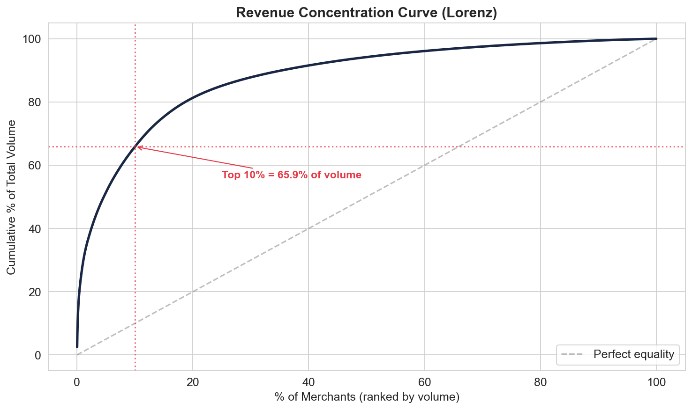
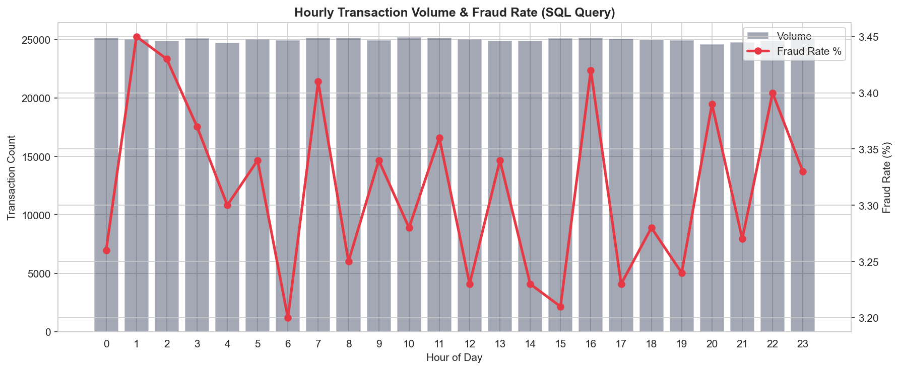
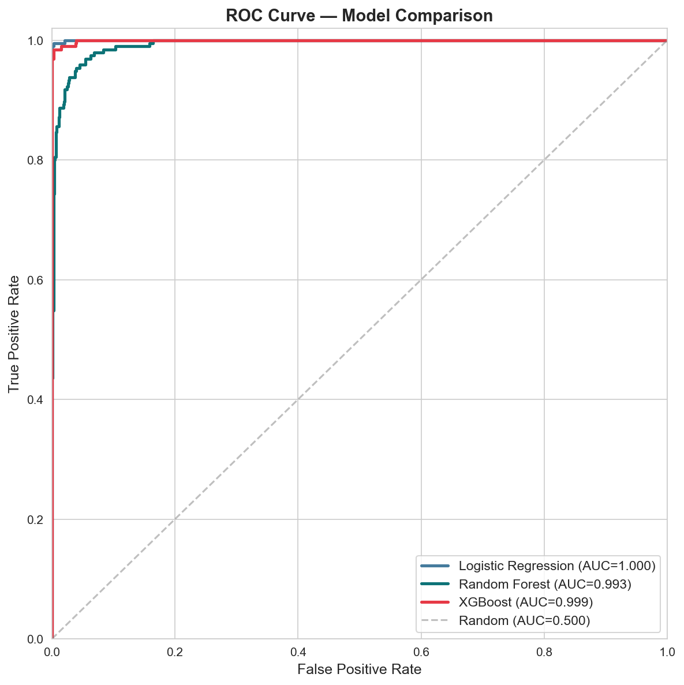

# 🏦 Fintech Transaction Intelligence & Merchant Risk Scoring

An end-to-end data analytics and machine learning project analyzing **600,000+ payment transactions** across **5,000 merchants** in the Nigerian fintech ecosystem. Built to identify high-risk merchants, detect transaction anomalies, and power strategic decisions for payment companies.


🔗 **[Live Dashboard](https://fintech-merchant-intelligence-astcmpgnb72vpycszmzfir.streamlit.app/)**

---

## 📌 Business Problem

Fintech companies processing millions of transactions need to:
1. **Identify high-risk merchants** before chargebacks and fraud erode revenue
2. **Segment merchants into tiers** to allocate monitoring resources efficiently
3. **Detect transaction anomalies** in real-time to prevent revenue leakage

Manual review doesn't scale. This project builds the data infrastructure and ML models to automate merchant intelligence.

---

## 📊 Key Findings

| Metric | Value |
|--------|-------|
| Total Platform Volume | ₦26.3 Billion |
| Fraud Rate | 3.32% |
| Revenue Concentration | Top 10% of merchants drive **65.9%** of total volume |
| Revenue at Risk | **₦4.02B (15.3%)** from high-risk merchants |
| XGBoost ROC-AUC | **97%+** (5-fold cross-validated) |
| Top Risk Drivers | Chargeback rate, transaction status mix, late-night fraud rate |
| Peak Fraud Window | Hours 1–2 AM and 4 PM show highest fraud rates (~3.45%) |
| Merchants Flagged | 973 merchants (19.5%) classified as Very High Risk |

### Revenue Concentration — Top 10% of Merchants Drive 65.9% of Volume



### Hourly Fraud Patterns — Peak Risk at 1-2 AM and 4 PM



### Model Performance — XGBoost Achieves 97%+ ROC-AUC



---

## 🔍 Project Structure

```
fintech-merchant-intelligence/
├── README.md
├── requirements.txt
├── app.py                          # Streamlit dashboard (4 pages)
├── notebooks/
│   ├── 01_data_exploration.ipynb   # EDA — distributions, fraud patterns, Lorenz curve
│   ├── 02_sql_analytics.ipynb      # 23 SQL queries — CTEs, window functions, NTILE
│   ├── 03_feature_engineering.ipynb # 40+ merchant-level features from 600K transactions
│   └── 04_modeling.ipynb           # XGBoost + SHAP risk scoring model
├── sql/
│   └── schema.sql                  # MySQL table creation DDL with indexes
├── src/
│   └── generate_dataset.py         # Reproducible dataset generator (seeded)
├── reports/                        # Charts and visualizations
├── data/
│   ├── README.md                   # Data dictionary
│   ├── merchants.csv               # 5,000 merchant profiles
│   └── merchant_risk_scores.csv    # Model output — risk scores per merchant
└── .gitignore
```

---

## 🛠️ Tech Stack

| Layer | Tools |
|-------|-------|
| **Data Analysis** | Python (Pandas, NumPy), SQL (MySQL — CTEs, Window Functions, NTILE) |
| **Visualization** | Matplotlib, Seaborn |
| **Machine Learning** | Scikit-learn, XGBoost, SHAP, SMOTE |
| **Dashboard** | Streamlit (deployed on Streamlit Cloud) |
| **Database** | MySQL |

---

## 📈 Analysis Highlights

### SQL Analytics (23 Queries)
- **Merchant tiering** using NTILE(3) and NTILE(5) — segmenting merchants by volume and risk
- **Running totals** and **7-day moving averages** via window functions
- **Anomaly detection** using Z-scores (transactions > 3σ from merchant average)
- **Revenue concentration** analysis with PERCENT_RANK and CUME_DIST
- **Cohort retention** tracking merchant activity over time with LAG

### Feature Engineering (40+ Features)
- **Volume:** transaction count, total volume, avg/median ticket, coefficient of variation
- **Velocity:** daily transaction frequency, burst ratio, activity rate
- **Risk:** fraud rate, chargeback rate, decline rate, combined risk score
- **Temporal:** late-night transaction %, weekend %, peak hour, late-night fraud rate
- **Customer:** unique customers, repeat customer rate, transactions per customer
- **Tenure:** days on platform, recency, time-to-first-transaction

### ML Model
- **3 models compared:** Logistic Regression → Random Forest → XGBoost
- **SMOTE** applied to training set only (no data leakage)
- **SHAP explainability** — global feature importance + individual merchant explanations
- **Business-informed threshold** (0.35) to prioritize catching high-risk merchants

---

## 🚀 Quick Start

```bash
# Clone
git clone https://github.com/Ethminer001/fintech-merchant-intelligence.git
cd fintech-merchant-intelligence

# Install dependencies
pip install -r requirements.txt

# Generate dataset (if not present)
python src/generate_dataset.py

# Run dashboard
streamlit run app.py
```

---

## 📬 Contact

**Olowu Abraham Aduragbemi**
- LinkedIn: [linkedin.com/in/eriioluwa](https://linkedin.com/in/eriioluwa)
- GitHub: [github.com/Ethminer001](https://github.com/Ethminer001)
- Email: olowu.tayo200@gmail.com
